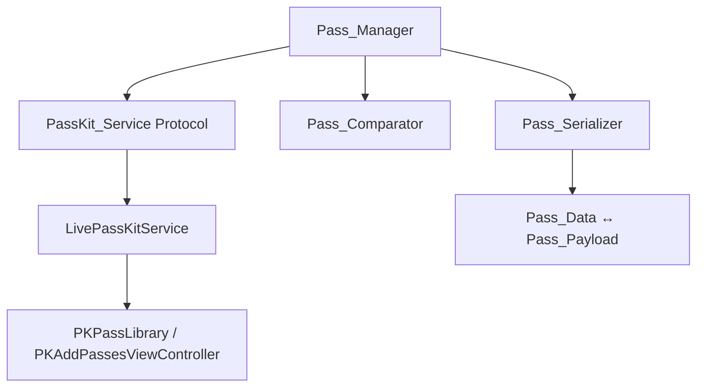

# Design Document: Apple Wallet Pass Manager

## Overview

The Apple Wallet Pass Manager is a Swift module that provides a clean API for managing Apple Wallet passes via the PassKit framework. It enables iOS applications to query, add, compare, and update passes in the user's Apple Wallet, keeping wallet passes in sync with app-held pass data.

The module is structured around four core responsibilities:

1. **Wallet Access** — Initialize and verify PassKit availability on the device.
2. **Pass Querying** — Search for existing passes by pass type identifier.
3. **Pass Comparison** — Diff wallet passes against app-held pass data to detect staleness.
4. **Pass Lifecycle** — Add new passes or update existing ones via the PassKit presentation flow.

The module targets iOS and uses Swift 6 concurrency. It exposes a protocol-oriented API so that PassKit interactions can be mocked in tests.

## Architecture



### Component Roles

- **Pass_Manager** — The public-facing orchestrator. Coordinates querying, comparison, addition, and update flows. Depends on abstractions (`PassKitService` protocol), not concrete PassKit types.
- **PassKitService (protocol)** — Abstraction over Apple's PassKit APIs (`PKPassLibrary`, `PKAddPassesViewController`). Enables dependency injection and testability.
- **LivePassKitService** — The production implementation of `PassKitService` that calls real PassKit APIs.
- **Pass_Comparator** — A pure function/struct that compares a `WalletPass` against `PassData` and returns a `ComparisonResult` with differing field names.
- **Pass_Serializer** — Handles encoding `PassData` → `PassPayload` (serialization) and `PassPayload` → `PassData` (deserialization).

### Key Design Decisions

| Decision | Rationale |
|---|---|
| Protocol for PassKit access | Allows unit testing without a real device or wallet |
| Value types for PassData, WalletPass | Immutability, Sendable conformance for Swift 6 |
| Separate Comparator and Serializer | Single responsibility; each is independently testable |
| Result-based error handling | Swift `Result` / typed throws for clear error propagation |

## Components and Interfaces

### PassKitService Protocol

```swift
protocol PassKitService: Sendable {
    /// Check if the device supports adding passes.
    func isWalletAvailable() -> Bool

    /// Query wallet for passes matching the given pass type identifier.
    func passes(ofType passTypeIdentifier: String) async throws -> [WalletPass]

    /// Present the add-pass UI to the user. Returns the outcome.
    func addPass(_ payload: PassPayload) async throws -> AddPassResult

    /// Replace an existing pass with an updated payload.
    func replacePass(existingPass: WalletPass, with payload: PassPayload) async throws
}
```

### PassManager

```swift
public struct PassManager: Sendable {
    private let service: PassKitService
    private let comparator: PassComparator
    private let serializer: PassSerializer

    /// Query wallet for existing passes matching the app's pass type.
    public func existingPasses(forType passTypeIdentifier: String) async throws -> [WalletPass]

    /// Add a new pass to the wallet from app-held data.
    public func addPass(from passData: PassData) async throws -> AddPassResult

    /// Compare a wallet pass against app data and update if needed.
    public func syncPass(walletPass: WalletPass, with passData: PassData) async throws -> SyncResult
}
```

### PassComparator

```swift
public struct PassComparator: Sendable {
    /// Compare a wallet pass against app pass data.
    /// Returns `.equivalent` or `.different(fields:)`.
    public func compare(walletPass: WalletPass, passData: PassData) -> ComparisonResult
}
```

### PassSerializer

```swift
public struct PassSerializer: Sendable {
    /// Serialize PassData into a PassPayload.
    public func serialize(_ passData: PassData) throws -> PassPayload

    /// Deserialize a PassPayload back into PassData.
    public func deserialize(_ payload: PassPayload) throws -> PassData
}
```


## Data Models

### PassData

```swift
public struct PassData: Sendable, Equatable, Codable {
    public let serialNumber: String
    public let passTypeIdentifier: String
    public let description: String
    public let relevantDate: Date?
    public let barcodePayload: String?
    // Additional fields as needed by the application
    public let organizationName: String
    public let teamIdentifier: String
}
```

### WalletPass

```swift
public struct WalletPass: Sendable, Equatable {
    public let serialNumber: String
    public let passTypeIdentifier: String
    public let description: String
    public let relevantDate: Date?
    public let barcodePayload: String?
}
```

### PassPayload

```swift
public struct PassPayload: Sendable {
    /// The raw `.pkpass` bundle data.
    public let data: Data
}
```

### Result Types

```swift
public enum AddPassResult: Sendable, Equatable {
    case added
    case cancelled
}

public enum ComparisonResult: Sendable, Equatable {
    case equivalent
    case different(fields: [String])
}

public enum SyncResult: Sendable, Equatable {
    case alreadyUpToDate
    case updated
    case addedAsNew(AddPassResult)
}
```

### Error Types

```swift
public enum PassManagerError: Error, Sendable, Equatable {
    case walletUnavailable
    case queryFailed(reason: String)
    case invalidPassData(missingFields: [String])
    case serializationFailed(reason: String)
    case deserializationFailed(reason: String)
    case addFailed(reason: String)
    case replaceFailed(reason: String)
    case missingInput(description: String)
}
```


## Correctness Properties

*A property is a characteristic or behavior that should hold true across all valid executions of a system — essentially, a formal statement about what the system should do. Properties serve as the bridge between human-readable specifications and machine-verifiable correctness guarantees.*

### Property 1: Query returns only matching passes

*For any* set of passes in the wallet and any pass type identifier, querying for that identifier should return exactly the passes whose `passTypeIdentifier` matches the query, and no others.

**Validates: Requirements 2.1, 2.2, 2.3**

### Property 2: Identical data yields equivalence

*For any* valid `PassData`, if a `WalletPass` is constructed with identical field values (serial number, description, relevant date, barcode payload), then the `PassComparator` should return `.equivalent`.

**Validates: Requirements 4.1, 4.2**

### Property 3: Field change detection

*For any* valid `PassData` and corresponding `WalletPass`, if exactly one of the required comparison fields (serial number, description, relevant date, barcode payload) is changed, then the `PassComparator` should return `.different(fields:)` containing exactly that field name.

**Validates: Requirements 4.3, 4.4**

### Property 4: Serialization round-trip

*For any* valid `PassData` object, serializing it into a `PassPayload` and then deserializing back should produce a `PassData` object equal to the original.

**Validates: Requirements 6.1, 6.2, 6.3, 3.1, 5.2**

### Property 5: Validation rejects incomplete PassData

*For any* `PassData` with one or more required fields missing or empty, the `PassManager` should return a `.invalidPassData(missingFields:)` error whose `missingFields` array contains exactly the names of the missing fields.

**Validates: Requirements 3.5**

### Property 6: Sync routing correctness

*For any* `WalletPass` and `PassData` pair where the comparator reports `.different`, if the serial numbers match then `syncPass` should perform an update (returning `.updated`), and if the serial numbers do not match then `syncPass` should route to the add-new-pass flow.

**Validates: Requirements 5.1, 5.6**

### Property 7: Malformed payload produces descriptive error

*For any* `PassPayload` containing data that is not a valid serialized `PassData`, deserialization should throw a `.deserializationFailed` error with a non-empty reason string.

**Validates: Requirements 6.4**

## Error Handling

| Scenario | Error | Handling |
|---|---|---|
| Device doesn't support Wallet | `.walletUnavailable` | Returned immediately on initialization check; caller should disable wallet features in UI |
| Wallet query fails | `.queryFailed(reason:)` | Wraps underlying `PKPassLibrary` error; caller retries or shows error |
| PassData missing required fields | `.invalidPassData(missingFields:)` | Returned before any PassKit interaction; caller fixes data |
| Serialization fails | `.serializationFailed(reason:)` | Returned when PassData → PassPayload encoding fails |
| Deserialization fails | `.deserializationFailed(reason:)` | Returned when PassPayload → PassData decoding fails |
| Add pass fails | `.addFailed(reason:)` | Wraps underlying PassKit error from add flow |
| Replace pass fails | `.replaceFailed(reason:)` | Wraps underlying PassKit error from replace flow |
| Nil input to comparator | `.missingInput(description:)` | Describes which input (walletPass or passData) was nil |

All errors conform to `Error`, `Sendable`, and `Equatable`. Error reasons include the underlying failure description when available.

## Testing Strategy

### Unit Tests

Unit tests verify specific examples, edge cases, and integration behavior using a mock `PassKitService`:

- **Wallet availability**: Mock returns supported/unsupported; verify correct result or error.
- **Query with no matches**: Mock returns empty list; verify empty result.
- **Query error propagation**: Mock throws; verify `.queryFailed` error surfaces.
- **Add pass — user confirms**: Mock simulates confirmation; verify `.added` result.
- **Add pass — user cancels**: Mock simulates cancellation; verify `.cancelled` result.
- **Add pass — failure**: Mock throws; verify `.addFailed` error surfaces.
- **Replace pass — success**: Mock simulates success; verify `.updated` result.
- **Replace pass — failure**: Mock throws; verify `.replaceFailed` error surfaces.
- **Nil comparator input**: Pass nil wallet pass or pass data; verify `.missingInput` error.

### Property-Based Tests

Property-based tests use [SwiftCheck](https://github.com/typelift/SwiftCheck) (or `swift-testing` with custom generators if SwiftCheck is unavailable) to verify universal properties across randomly generated inputs. Each test runs a minimum of 100 iterations.

Each property test references its design property with a comment tag:

- **Feature: apple-wallet-pass-manager, Property 1: Query returns only matching passes** — Generate random sets of `WalletPass` with varied `passTypeIdentifier` values and a random query identifier. Assert the filtered result contains exactly the matching passes.
- **Feature: apple-wallet-pass-manager, Property 2: Identical data yields equivalence** — Generate random `PassData`, construct a matching `WalletPass`, assert comparator returns `.equivalent`.
- **Feature: apple-wallet-pass-manager, Property 3: Field change detection** — Generate random `PassData` and a random field to mutate. Construct a `WalletPass` with that one field changed. Assert comparator returns `.different(fields:)` containing exactly that field.
- **Feature: apple-wallet-pass-manager, Property 4: Serialization round-trip** — Generate random valid `PassData`. Serialize then deserialize. Assert equality with original.
- **Feature: apple-wallet-pass-manager, Property 5: Validation rejects incomplete PassData** — Generate `PassData` with random subsets of required fields removed. Assert `.invalidPassData(missingFields:)` contains exactly those fields.
- **Feature: apple-wallet-pass-manager, Property 6: Sync routing correctness** — Generate random `WalletPass`/`PassData` pairs with matching or non-matching serial numbers and differing fields. Assert correct routing (update vs. add-new).
- **Feature: apple-wallet-pass-manager, Property 7: Malformed payload produces descriptive error** — Generate random `Data` that is not valid serialized `PassData`. Assert `.deserializationFailed` with non-empty reason.

### Test Configuration

- Property-based testing library: **SwiftCheck** (via Swift Package Manager)
- Minimum iterations per property: **100**
- Each property test tagged with: `Feature: apple-wallet-pass-manager, Property {N}: {title}`
- Each correctness property implemented by a single property-based test
